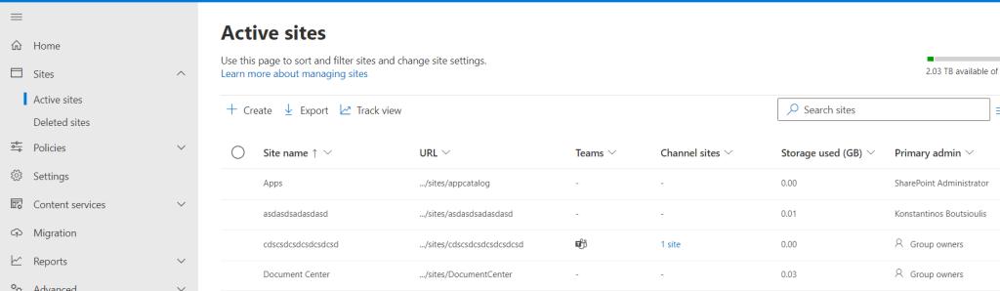
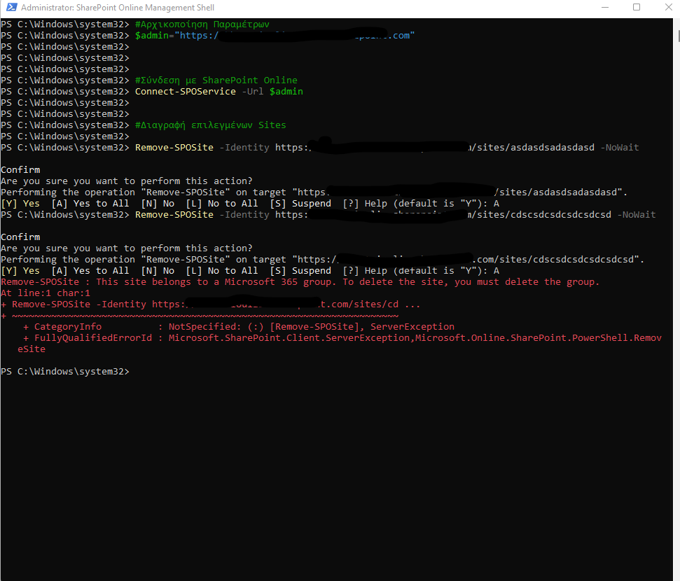

In today's article we will see how to delete a SharePoint site using PowerShell

It is a very simple process in which by running a simple PowerShell we delete the site

To run the command you need administrator privileges

As you can see from the SharePoint admin center in the active sites are both sites with strange titles asdasdsadasdasd and cdscsdcsdcsdcsdcsd which we want to delete because they are test pages




Locate the sites we want to delete and execute the following command


```
#Initialisation of Parameters
$admin="https://mytenant-admin.sharepoint.com"


#Open Connection with SharePoint Online
Connect-SPOService -Url $admin


#Delete selected Sites
Remove-SPOSite -Identity https://mytenant.sharepoint.com/sites/asdasdsadasdasd -NoWait
Remove-SPOSite -Identity https://mytenant.sharepoint.com/sites/cdscsdcsdcsdcsdcsd -NoWait

```




Here it should be noted that the deletion moves the site to deleted and does not delete it, however, so from the deleted site can be restored within the time frame you have set

Additionally it should be noted that the site should not be asssociated with 365 group because in this case you will get an error which will not allow you to delete the site before you delete the group

This site that was not deleted was done since the corresponding group was created in Teams

In case you wish to restore the sites you will again need to run the following PowerShell with administrator privileges to restore them to their original pre-deletion state


```
#Initialisation of Parameters
$admin="https://mytenant-admin.sharepoint.com"


#Open Connection with SharePoint Online
Connect-SPOService -Url $admin


#Restore Deleted Sites from the Recucle Bin
Restore-SPODeletedSite -Identity https://mytenant.sharepoint.com/sites/asdasdsadasdasd -NoWait
Restore-SPODeletedSite -Identity https://mytenant.sharepoint.com/sites/cdscsdcsdcsdcsdcsd -NoWait

```

More Information about deleting sites can be obtained from the official Microsoft site at


https://learn.microsoft.com/en-us/powershell/module/sharepoint-online/remove-sposite?view=sharepoint-ps&WT.mc_id=M365-MVP-5004210


